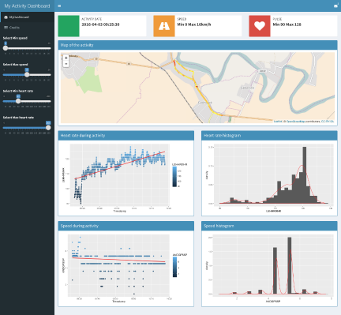

```{r setup, include=FALSE}
knitr::opts_chunk$set(echo = FALSE)
# server.R
library(ggplot2)
library(grid)
library(stringr)
library(leaflet)

fileType <-  read.csv(file="../fileType.csv", header=TRUE, sep=",")


parseFile <- function(fileName, shortName, directory, timestamp) {
        filename <- paste(c(directory,"/",as.character(fileName),timestamp,".csv"), collapse="")
        result = NULL
        str(filename)
        if(file.exists(filename)){
                result <- read.table(filename,  sep=",", header=F)
                names(result) <- c("Date", "Time", as.character(shortName))
                result$Timestamp <- strptime(paste(as.Date(result$Date),result$Time), "%Y-%m-%d %H:%M:%S")
        } 
        return(result)
}

parseAllFiles <- function(directory, timestamp) {
        result <- list()
        for(i in 1:nrow(fileType)) {
                row <- fileType[i,]
                temp <- parseFile(row$FileName,row$FileName,directory, timestamp)
                result[[as.character(row$FileName)]] <- temp
        }
        return(result);
        
}

files <- data.frame(dir=c("../data/Walking1", "../data/Walking2", "../data/Walking3", "../data/Walking4","../data/Walking5","../data/Walking6"),
                    date=c("2016-02-13-10-37-50","2016-02-14-14-04-39","2016-02-17-17-04-22","2016-02-18-17-04-44","2016-04-02-09-02-29","2016-04-03-08-28-28"))

directory <- as.character(files[6, ]$dir)
timestamp <- as.character(files[6, ]$date)


walking <-  parseAllFiles(directory, timestamp)
```

## Introduction
My Activity Dashboard is a project developed for the Coursera course called Developing Data Products and show how data can be managed and presentede using Shiny. 

This dashoard shows the results on walking trip as recorded from my android phone. 


 
## Hardware 
The data was recored using a Motorola Moto G Android phone with the SenseView application ([https://play.google.com/store/apps/details?id=si.mobili.senseview]) installed and connected to a Polar H7 belt ([http://www.polar.com/us-en/products/accessories/H7_heart_rate_sensor]) in order to record the heart rate data. 

Information from the GPS and acceletarion sensor are also saved and exported at the end of the trip.

The complete code for read the data recorded from the SenseView application was developed for this project.

```{r load, echo=TRUE}
summary(walking)
```


## Application
The application is a simple dashboard that allow to see all the information recorded during a trip [https://valerio-vaccaro.shinyapps.io/MyActivityDashboard/]

It allow you to see:

- the map of the trip
- information about heart rate on temporal base and on historgram
- information about speed on temporal base and on historgram

The dasboard is able to filter speed and heart rate date in order to select a subset of observations.

The complete code is available on my github repository at [https://github.com/valerio-vaccaro/developing-data-products---MyActivityDashboard-assignement].


## Charts
Principal information about speed and heart rate are calculated and shows using charts.

```{r chart}
data <- walking$LEHHRMHR
p1 <- ggplot(data=data) +
        geom_histogram(aes(x=LEHHRMHR, y =..density..)) +
        geom_density(aes(x=LEHHRMHR), col=2)
        
p2 <- ggplot(data=data) + 
        geom_point(aes(x=Timestamp, y=LEHHRMHR, color=LEHHRMHR)) +
        geom_smooth(aes(x=Timestamp, y=LEHHRMHR), method = "glm", col=2)

#data <- hoovering$LEHHRMHR[hoovering$LEHHRMHR$LEHHRMHR > 30, ]
data <-  merge(walking$ANDGPSLA, walking$ANDGPSLO, by=c("Date","Timestamp"))
data <-  merge(data, walking$ANDGPSSP, by=c("Date","Timestamp"))

p3 <- ggplot(data=data) +
        geom_histogram(aes(x=ANDGPSSP, y =..density..)) +
        geom_density(aes(x=ANDGPSSP), col=2)

p4 <- ggplot(data=data) + 
        geom_point(aes(x=Timestamp, y=ANDGPSSP, color=ANDGPSSP)) +
        geom_smooth(aes(x=Timestamp, y=ANDGPSSP), method = "glm", col=2)

p5 <- ggplot(data=data) + 
        geom_point(aes(x=ANDGPSLA, y=ANDGPSLO, color=ANDGPSSP)) 
grid.newpage()
pushViewport(viewport(layout = grid.layout(4, 2, heights = unit(c(0.5, 5, 5, 5), "null"))))   
grid.text("MAIN TITLE", vp = viewport(layout.pos.row = 1, layout.pos.col = 1:2))
print(p1, vp = viewport(layout.pos.row = 2, layout.pos.col = 1))         
print(p2, vp = viewport(layout.pos.row = 2, layout.pos.col = 2))
print(p3, vp = viewport(layout.pos.row = 3, layout.pos.col = 1))
print(p4, vp = viewport(layout.pos.row = 3, layout.pos.col = 2))
print(p5, vp = viewport(layout.pos.row = 4, layout.pos.col = 1:2))
```

## Leaflet
The application use the leaflet maps for show the recorded points in the space.

```{r leflets, echo=TRUE}
data <-  merge(walking$ANDGPSLA, walking$ANDGPSLO, by=c("Date","Timestamp"))
data <-  merge(data, walking$ANDGPSSP, by=c("Date","Timestamp"))
colors <- heat.colors(7)[floor(data$ANDGPSSP) + 1]
colors <- substr(colors, 1, 7)
colors[is.na(colors)] <- "#aaaaaa"
leaflet() %>%
   addTiles() %>%  
   addCircleMarkers(data=data.frame(lat=data$ANDGPSLA, lng=data$ANDGPSLO), 
      radius=2, weight=0, fillColor=colors, fillOpacity=0.5)
```